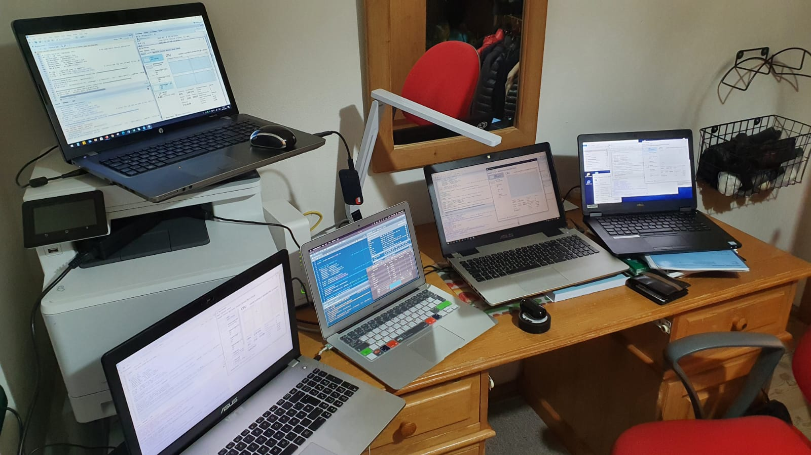

```{r setup, include=FALSE}
knitr::opts_chunk$set(echo = TRUE)
```
<div class = 'media'>

<p>Pierre Mulliez </n> </p>
</div>


<style>

.menutop{
    background-color: Gainsboro;
    padding: 1%;
    overflow: hidden;
    display:flex;
    
}.menutop a{
    font-family: inherit;
    font-size: 20px;
    padding: 14px 16px; 
    text-align:center;
    text-decoration: none;
    color: black;
    float: left;
    display: block;
}

.menutop a:hover{
    background-color: whitesmoke;
    border-radius: 20%;
}
.media{
    background: whitesmoke;
}
.media p{
   font-size: 20px;
    padding: 14px 16px; 
    text-align:center;
    text-decoration: none;
    display: none;
}
.media:hover p{
  display: block;
}

.container_img{
width:200px;
height: 150px;
overflow: visible;
}


.dropbtn {
  background-color: Gainsboro;
  color: white;
  padding: 16px;
  font-size: 16px;
  border: none;
  cursor: pointer;
}

.dropdown {
  position: relative;
  display: block;
}

.dropdown-content {
  display: none;
  background-color: #f9f9f9;
  min-width: 160px;
  box-shadow: 0px 8px 16px 0px rgba(0,0,0,0.2);
  z-index: 1;
}

.dropdown-content a {
  color: black;
  padding: 12px 16px;
  text-decoration: none;
  display: inline-block;
 
}

.dropdown-content a:hover {
  background-color: #f1f1f1;
  border-bottom: solid;
  border-color: orange; 
  border-width: 3px;}

.dropdown:hover .dropdown-content {
  display: flex;
}

.dropdown:hover .dropbtn {
  background-color: whitesmoke;
}


@media screen and (max-width: 510px) {
    .menutop{
        margin-bottom: 3%;
    }
    
    .menutop a {
    float:none;
    width: 100%;
    font-size: 18px;
  }
  
}

</style>

<h3 class = 'menutop' id="Contents">
  [Contents](#Contents)
  [Introduction](#Introduction)

<div class="dropdown">
<a class="dropbtn">Data analysis</a>
<div class="dropdown-content">
  [dates](#dates)
  [station_location](#station_location)
  [heatmaps](#heatmaps)
</div>
</div>
  [Data Preparation](#data_preparation)
  [Data Processing](#data_processing)
  [Building the Model](#building_the_model)
</h3>
<body style = "font-family: Arial, Helvetica, sans-serif;">
<a center class="anchor" id="Introduction" style="background-color:Gainsboro; width:40%;"></a>
<center style="background-color:Gainsboro; width:40%;">Introduction</center>


> 'As part of the course **"Programming in R" at IE - HST**, we foster our newly learned skills by participating in a Kaggle competition. The problem requires us to do Exploratory Data Analysis, Data Cleaning and Manipulation and implement some sort of Machine Learning in R.'

The data can be found  [here](https://www.kaggle.com/c/ams-2014-solar-energy-prediction-contest/overview)


```{r, echo=F}
library(data.table)

rm(list=ls())  #clean environment
#Pierre RDS source
#solar_data <- readRDS('/Documents and Settings/Pierre Computer/Documents/IE_classes/R/group project/solar_dataset.RData')
#Ivan RDS source
#solar_data <- readRDS('C:/Users/Ivan.Polakovic/Desktop/IE/R/group assignment/solar_dataset.RData')
#Max RDS source
#solar_data <- readRDS('/Users/admin/OneDrive/Documents/IE - Madrid/Term 1/01 R Programming/Group Assignment/GitHub/data/solar_dataset.RData')
#Oxana RDS source
solar_data <- readRDS(file.path("~","Downloads","R","Group project","solar_dataset.RData"))
#Oxana file path
file_path_stations <- file.path("~","Downloads","R","Group project","station_info.csv")
```
```{r, echo=F}
###prepare dataset
solar_data_dt <- solar_data[,list(solar_data[1:5113,])]
#convert coltype
solar_data_num <- sapply(solar_data_dt[,2:length(solar_data_dt)],as.double)
solar_data_dt <- cbind(solar_data_dt[,1],solar_data_num)
visualisation_solar <- solar_data_dt[,2:99]

#summary data table 
#data conversion for further analysis
analysis <- function(df){
  name <- as.character(colnames(df))
  IQR <- as.integer(lapply(df, IQR, na.rm = TRUE))
  median <- as.integer(lapply(df, median, na.rm = TRUE))
  mean <- as.integer(lapply(df, mean, na.rm = TRUE))
  stdv <- as.integer(lapply(df,sd,na.rm = TRUE))
  maxi <- as.integer(lapply(df,max,na.rm = TRUE))
  mini <- as.integer(lapply(df,min,na.rm = TRUE))
  analysed <- data.table(names = name,average = mean,median = median,quantile_range = IQR, standard_deviation = stdv, maximum = maxi, minimum = mini)
  return(analysed)
}

#summary of analysis 
solar_analyzed <- analysis(visualisation_solar)
```


<div id= 'dates'>

# Exploratory Data Analysis Highlights

In order to carry out this task, we are first going to take a closer look at the data available, to determine which transformations should be taken place before we proceed to data processing stage and then make the predictive model.

## Including Plots: Dates dependent

We have designed several plots to understand and include the right variable in our prediction, first we took a closer look at the stations pattern depending on the dates:

### Here an overall visualization

```{r date_variant, echo=FALSE}
setDT(solar_data_dt)
date_visualization <- solar_data_dt[, .(AVG = rowMeans(.SD)),Date]
scatter.smooth(date_visualization)
```

### Here visualizing by month - averaging the stations

```{r month_variant,echo=FALSE}
Monthlymeans <- date_visualization[,substr(Date, 5, 6)]
plot(x = Monthlymeans,y = date_visualization$AVG,main = "average by date",xlab = "Date in int format",ylab = "Average of stations")
```
</div>
<div id= 'station_location'>

## Including Plots: station coordinates dependent
We have merged the station additional information file with the summary of each stations as a data table to produce a comprehensible comparison  between the average of each stations accross all date, its altitude and coordinate 

### Here we are plotting each station to its location on a map with a color code corresponding to it's altitude 
```{r coordinates, echo=FALSE}
#stations coordinates analysis
coordinates <- read.table(file_path_stations,header = TRUE,sep = ',')

#install.packages('ggmap')
library(ggmap)
#?ggmap
par(mfrow=c(2,2))
map <- qmplot(elon, nlat, data = coordinates, colour = I('black'), size = I(3), darken = .3,main = 'map of stations')
elevation <- map + geom_point(data = coordinates, aes(color  = elev))
plot(elevation +  scale_colour_gradientn(colours = rev(rainbow(8)),
                                  breaks = c(150, 300, 450, 600, 850),
                                  trans = "log10"))
```

### And to compliment that, here we are plotting each station to its location on a map with a color code corresponding to it's average over time 

```{r averages, echo=FALSE}
#search for pattern between coordinate, elevation and observations
mapo <- qmplot(elon, nlat, data = coordinates, colour = I('black'), size = I(3), darken = .3,main = 'map of observations')
#merge the summary with elevation
merged <- merge(x=solar_analyzed,y=coordinates,by.x = "names",by.y = "stid"  )
mapobserved <- mapo + geom_point(data = merged, aes(color  = average))
plot(mapobserved +  scale_colour_gradientn(colours = rev(rainbow(8)),
                                    breaks = c(150, 300, 450, 600, 850),
                                    trans = "log10"))
par(mfrow=c(1,1))
```
</div>

## Plot conclusion
<ul>
<li> Using GGMAP function, we were able to find a strong correlation between altitude and average observation </li>
<li> Data is time variant with seasonnality pattern; higher osbervation are noticed in the summer month </li>
<li> Data is dependent upon location and elevation with higher / west stations recording higher observation </li>
</ul>

## Correlation among stations
<div id='heatmaps'>
Following the analysis on their relative observation based on their location we thought we could establish some segmentation:

```{r heatmaps, echo=FALSE}
# Scatterplots per Column
dt <- data.table(visualisation_solar)
x <- dt[1:5113, 2:98] 
res = cor(x)
corr_dt = as.data.table(res)


# Correlation Heatmat & Clustering
correlation <- visualisation_solar[,x:= list(cor(visualisation_solar[,.SD]))]
correlation <- as.data.frame(correlation$x[1])
# Use 'scale' to normalize
correlation <- sapply(X = correlation,FUN = as.double)
data <- as.matrix(correlation)
# Default Heatmap
heatmap(data, scale="column")
```
</div>

<div class= 'station_distribution'>
## More on stations: distributions:

```{r distribution, echo=FALSE}
#plot analysis = review 
plot(x = solar_analyzed$average,y = solar_analyzed$standard_deviation,xlab = "mean", ylab= "standard dev")
means <- mean(solar_analyzed$average)
stdev <- sd(solar_analyzed$average)
onebin <- means + stdev
twobin <- means + stdev*2
threebin <- means + stdev*3
monebin <- means - stdev
mtwobin <- means - stdev*2
mthreebin <- means - stdev*3
distribution <- data.frame(mthreebin,mtwobin,monebin,means,onebin,twobin,threebin)
distribution <- sapply(distribution, as.integer) 
#standard deviation per month  
sd.d=function(x){sqrt((length(x)-1)/length(x))*sd(x)}
#logarythm to simulate normal distribution ?
dev_month <- date_visualization[,list(standarddev = sd.d(log(AVG))),list(Month = substr(Date, 5, 6))]
#plots
par(mfrow=c(2,2)) 
plot(density(solar_analyzed$average), type = "l", col = "red",xlab = "averages by stations",main = "average station distribution")
plot(dev_month, type = "l", col = "red",xlab = "average by month",main = "average date deviation (log)")
plot(density(distribution), type = "l", col = "blue",xlab = "expected deviation",main = "expected station distribution")
hist(solar_analyzed$average, col = "green", breaks = 5,xlab = "average hist",main = "Histogram of stations averages");
par(mfrow=c(1,1)) 
```

<div id= 'data_preparation'>
# DATA PREPARATION 

In order to obtain the results displayed above, we needed to prepare and the data: 
<ul>
<li> Finding NA ratio per column in order to see their potential influence the analysis</li>
<li> We needed to find and map the extreme outliers </li>
</ul>

## Outliers

### Finding outliers

```{r, echo=FALSE}
boxplot(x = as.list(solar_data[,2:99]))
```

</div>

<div id= 'data_processing'>
# DATA PROCESSING

<ul>
<li> Once we had our outliers mapped, we replaced them with NA values in order to decrease the potential bias</li>
<li> Then once we have tackled the outliers, it was time to split the data and start training our model </li>
</ul>


## Splitting into training and testing sets.

 We will be training our model with 70% of the original data, valuating and then testing with 15% each. </li>
 
```{r, echo = TRUE}
train_index <- sample(1:nrow(solar_data), 0.7*nrow(solar_data))
val_index <- sample(setdiff(1:nrow(solar_data), train_index), 0.15*nrow(solar_data));  
test_index <- setdiff(1:nrow(solar_data), c(train_index, val_index))

```

</div>

<div id= 'building_the_model'>

# BUILDING THE MODEL

While looking for our top performing model, we looked at the variety of different algorithms that could be used for this purpose, including **xgboost** and **svm**. After testing multiple models, we came to the conclusion that **auto.arima** was best suited for the purposes of this assigments, so we are going to showcase it below.

*Although forecasting models might not have been the best choice for this kind of problem, we chose to go with auto.arima.* The reason for this was, that we started with this part of the group-work before we had the classes on 'ML with R' and our intuition has guided us here.

With this lack of knowledge, we went for a pipeline, that would allow for model validation via a system-call of the the Kaggle API from R. However, this means that our best model does not implement a proper  train/test split, it does not make use of Hyper-Parameter Tuning or Cross Validation, and is probably far from efficient compared to other models.

After some experimentation with the models from the forecast package (incl. naive, ses, holt, arima, tbats, nnetar) we found that auto.arima resulted in the best scores. When we added additional external regressor variables, the score further improved. When we added the variables from the principal component analysis
provided by the professor the score continued to improve, however the processing time also increased substantially. 

To decrease processing time, we paralleled the prediction by rows, which resulted in an increase of performance. 

**The last run of this prediction happened on 8 cores and took about 40h**. The scores achieved with auto.arima heavily depended on the amount of PCA-Variables used as external regressors.

What it took us to build this model


[In case image doesn't work, see here](https://imgur.com/a/QKktlXN)

**We are very excited for you to see our final model!**

</div>
